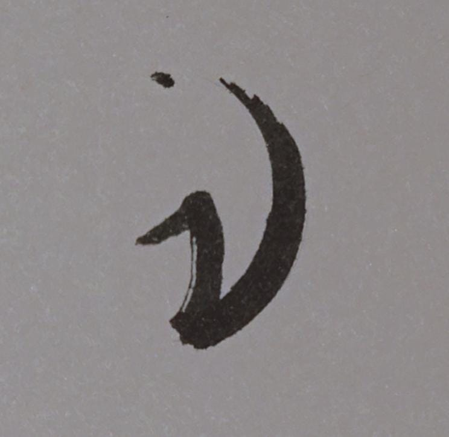

# **Nuclear Logo**
*Documentation of ideation behind the logo*

---

**Nuclear Logo Preview:**

  
  

 

The idea for the logo is the lowercase letter of Greek Alphabet, 'Nu'.

The logo itself is imitating a stroke of an ink pen drawing the letter with a gradient on one of the ends. The secondary color in the gradient represents the current mode of the app.

The stroke of the logo originally started as a physical drawing in my notebook.

